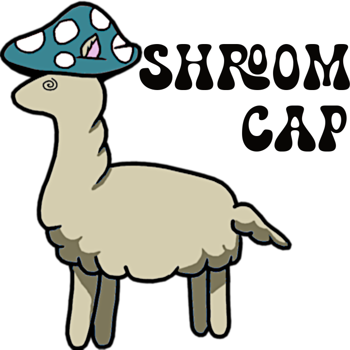

# SHROOM-CAP: Shared-task on Hallucinations and Related Observable Overgeneration Mistakes in Crosslingual Analyses of Publications

Public repository for SHROOM-CAP @ CHOMPS 2025 (AACL-IJCNLP, Mumbai, India). The repository contains the clean CAP dataset ([Gamba et el. 2026](https://arxiv.org/abs/2510.22395)) in the `data/release_folder/` to support future research on scientific hallucination detection.




**Contents:**  
- Language specific data (unsplit, unsorted), in `data/<language>`  
- Logos and other assets in `assets/`  

**Timeline**
Until 15th July : Dev-I release (en/fr/es/hi*)

- Starter Release – July 15
- Training Phase July 20 – October 5, 2025
- Testing Phase October 5 – October 15, 2025
- Paper Submission Deadline October 25, 2025
- Notification of Acceptance November 3, 2025
- Camera-ready Due November 11, 2025
- Proceedings Due December 1, 2025


**Acknowledge us ;)**

```bibtex

@article{gamba2025confabulations,
  title={Confabulations from acl publications (cap): A dataset for scientific hallucination detection},
  author={Gamba, Federica and Sinha, Aman and Mickus, Timothee and Vazquez, Raul and Bhamidipati, Patanjali and Savelli, Claudio and Chattopadhyay, Ahana and Zanella, Laura A and Kankanampati, Yash and Remesh, Binesh Arakkal and others},
  journal={arXiv preprint arXiv:2510.22395},
  year={2025}
}

@inproceedings{sinha-etal-2025-shroom,
    title = "{SHROOM}-{CAP}: Shared Task on Hallucinations and Related Observable Overgeneration Mistakes in Crosslingual Analyses of Publications",
    author = "Sinha, Aman  and
      Gamba, Federica  and
      V{\'a}zquez, Ra{\'u}l  and
      Mickus, Timothee  and
      Chattopadhyay, Ahana  and
      Zanella, Laura  and
      Arakkal Remesh, Binesh  and
      Kankanampati, Yash  and
      Chandramania, Aryan  and
      Agarwal, Rohit",
    editor = {Sinha, Aman  and
      V{\'a}zquez, Ra{\'u}l  and
      Mickus, Timothee  and
      Agarwal, Rohit  and
      Buhnila, Ioana  and
      Schmidtov{\'a}, Patr{\'i}cia  and
      Gamba, Federica  and
      Prasad, Dilip K.  and
      Tiedemann, J{\"o}rg},
    booktitle = "Proceedings of the 1st Workshop on Confabulation, Hallucinations and Overgeneration in Multilingual and Practical Settings (CHOMPS 2025)",
    month = dec,
    year = "2025",
    address = "Mumbai, India",
    publisher = "Association for Computational Linguistics",
    url = "https://aclanthology.org/2025.chomps-main.7/",
    pages = "70--80",
    ISBN = "979-8-89176-308-1",
    abstract = "This paper presents an overview of the SHROOM-CAP Shared Task, which focuses on detecting hallucinations and over-generation errors in cross-lingual analyses of scientific publications. SHROOM-CAP covers nine languages: five high-resource (English, French, Hindi, Italian, and Spanish) and four low-resource (Bengali, Gujarati, Malayalam, and Telugu). The task frames hallucination detection as a binary classification problem, where participants must predict whether a given text contains factual inaccuracies and fluency mistakes. We received 1,571 submissions from 5 participating teams during the test phase over the nine languages. In the paper, we present an analysis of the evaluated systems to assess their performance on the hallucination detection task across languages. Our findings reveal a disparity in system performance between high-resource and low-resource languages. Furthermore, we observe that factuality and fluency tend to be closely aligned in high-resource languages, whereas this correlation is less evident in low-resource languages. Overall, SHROOM-CAP underlines that hallucination detection remains a challenging open problem, particularly in low-resource and domain-specific settings."
}
```
